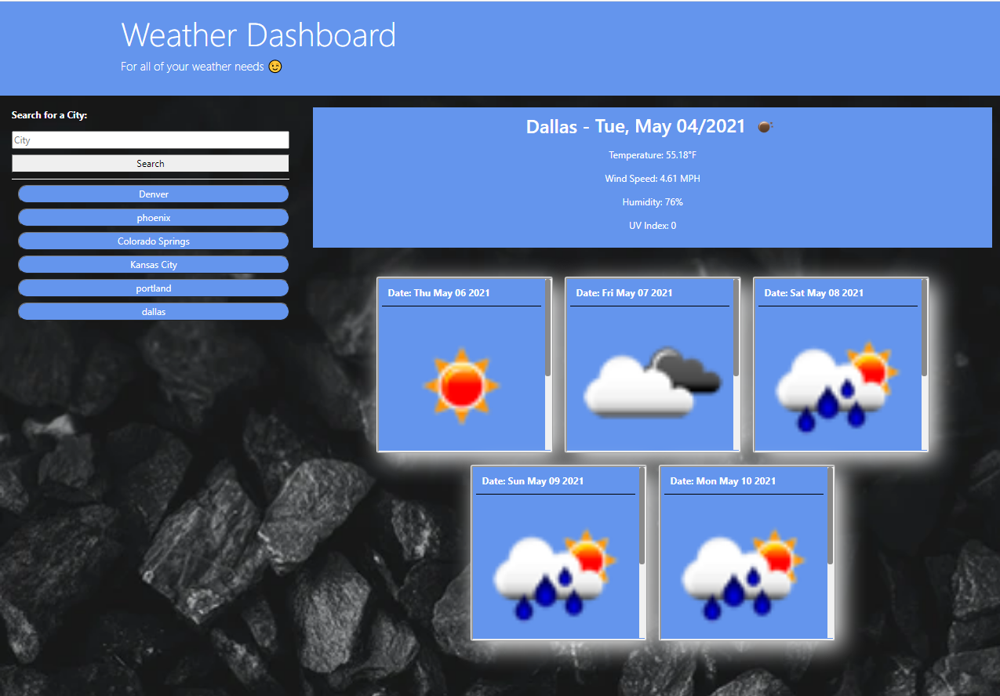

# weather-dashboard

## Table of Contents

- [Instructions](#Instructions)
- [Description](#Description)
- [Deployed Application](#Deployed-Application)
- [Links](#Links)
- [Features](#Features)

## Instructions

Click into the text form and enter a valid city name. Press the 'ENTER' key, or click on the 'SEARCH' button, in order to fetch the city's current and forecasted weather.

## Description

An application that allows the user to search for any city and view the current weather, in addition to, the weather forecast for the next 5 days.

## Deployed Application

## Links

- [GitHub](https://github.com/zachraab/weather-dashboard)
- [Deployed](https://zachraab.github.io/weather-dashboard/)

## Features

- weather information based on user search
